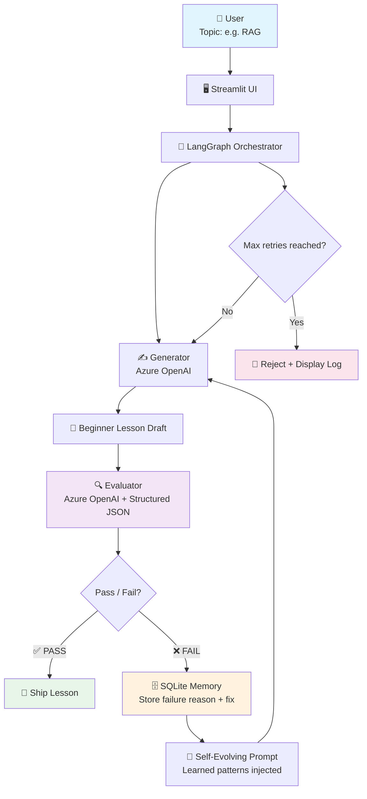
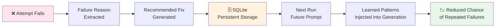

<div align="center">

# 🤖 Self-Evaluating Lesson Content Generator

### Generate · Evaluate · Learn · Regenerate · Ship

[](https://python.org)
[](https://langchain-ai.github.io/langgraph/)
[](https://azure.microsoft.com/en-us/products/ai-services/openai-service)
[](https://streamlit.io/)
[](https://sqlite.org/)
[](https://docs.pydantic.dev/)
[](LICENSE)

<br/>

> **An enterprise-grade agentic system that creates beginner AI lessons —**  
> **and decides whether they are good enough to ship.**

<br/>

[🚀 Quick Start](#-quick-start) · [🏗️ Architecture](#️-architecture) · [🧪 Quality Gates](#-hard-quality-gates) · [🧠 Self-Evolving Memory](#-self-evolving-memory) · [⚙️ Configuration](#️-configuration) · [🎥 Error Demo](#-deliberate-error-demo)

</div>

---

## 🎯 Assessment Coverage

| Requirement | Implementation |
|---|---|
| Generate lesson | Azure OpenAI Generator |
| Evaluate quality | Independent structured Evaluator |
| Hard pass / fail | 6 mandatory checkpoints — no partial credit |
| Regenerate on failure | LangGraph conditional loop |
| Termination guarantee | Maximum 2 retries |
| Rejection log | Stored and displayed per run |
| Self-evolving | Previous failures influence future prompts |
| Persistent memory | SQLite — survives across application runs |
| Agentic workflow | LangGraph state machine |
| UI | Streamlit dashboard |
| Enterprise readiness | Azure OpenAI v1 endpoint |

---

## 🏗️ Architecture



### Full Agentic Loop

```
User provides topic
        │
        ▼
  GENERATOR (Azure OpenAI)
  Produces beginner lesson
        │
        ▼
  EVALUATOR (Azure OpenAI + Pydantic)
  Scores all 6 hard checkpoints
        │
   ┌────┴────┐
 PASS      FAIL
   │          │
   ▼          ▼
 SHIP    Store failure in SQLite
         ↓
         Convert to actionable feedback
         ↓
         Inject into next generation prompt
         ↓
         REGENERATE (max 2 retries)
         ↓
         Still failing → Reject + display log
```

---

## 🧪 Hard Quality Gates

Every checkpoint must pass. There is **no partial credit**. A single critical failure triggers rejection and regeneration.

| # | Gate | What It Checks |
|---|------|----------------|
| 1 | ✅ **Accuracy** | Factually correct — no hallucinated definitions |
| 2 | ✅ **Beginner Language** | No assumed prior knowledge |
| 3 | ✅ **Relatable Example** | Real-world analogy or illustration |
| 4 | ✅ **No Unexplained Jargon** | Every technical term is defined inline |
| 5 | ✅ **What + Why + How** | Covers all three dimensions of the concept |
| 6 | ✅ **Teaching Flow** | Logical, progressive structure |

> A lesson with a single incorrect definition will not ship — even if the other 5 gates pass. Hard pass/fail prevents high average scores from masking critical errors.

---

## 🧠 Self-Evolving Memory

The system learns from its own failures across runs:



> This memory **persists across application runs** — not just within a session.

---

## 🚀 Quick Start

### 1 · Clone

```bash
git clone <YOUR_GITHUB_REPOSITORY_URL>
cd genai-content-system
```

### 2 · Create virtual environment

```bash
# Windows PowerShell
python -m venv .venv
.venv\Scripts\Activate.ps1

# Git Bash / macOS / Linux
python -m venv .venv
source .venv/Scripts/activate
```

### 3 · Install dependencies

```bash
pip install -r requirements.txt
```

### 4 · Configure Azure credentials

```bash
cp .env.example .env
# Edit .env with your Azure OpenAI credentials
```

### 5 · Run CLI

```bash
python main.py --topic "Introduction to RAG"
```

### 6 · Run Streamlit UI

```bash
streamlit run app.py
```

---

## ⚙️ Configuration

```env
# ── Azure OpenAI ───────────────────────────────────────────
AZURE_OPENAI_API_KEY=your_key
AZURE_OPENAI_ENDPOINT=https://YOUR-RESOURCE-NAME.openai.azure.com/
AZURE_OPENAI_DEPLOYMENT_NAME=your-deployment-name

# ── Evaluator (optional separate deployment) ───────────────
AZURE_OPENAI_EVALUATOR_DEPLOYMENT_NAME=   # leave blank to use same deployment

# ── Agentic Loop ───────────────────────────────────────────
MAX_RETRIES=2
```

> If `AZURE_OPENAI_EVALUATOR_DEPLOYMENT_NAME` is supplied, the evaluator uses a separate Azure deployment — reducing generator/evaluator coupling and allowing independent model configuration.

**Endpoint format:**

```
https://YOUR-RESOURCE-NAME.openai.azure.com/openai/v1/
```

---

## 🎥 Deliberate Error Demo

Run the injected-error workflow to see the full reject → learn → retry cycle:

```bash
python main.py --topic "Introduction to RAG" --inject-error
```

The first attempt contains two deliberate errors:

```
RAG permanently retrains the model every time it reads a document.
Vector database.
```

The evaluator rejects it for failing:
- **Accuracy** — retraining claim is factually wrong
- **No Unexplained Jargon** — "Vector database" left undefined

Then the system:

| Step | Action |
|------|--------|
| 1 | Adds failure to the rejection log |
| 2 | Stores failure reason in SQLite |
| 3 | Converts reason into actionable feedback |
| 4 | Injects feedback into the next generation prompt |
| 5 | Regenerates — errors corrected automatically |

---

## 📁 Project Structure

```
genai-content-system/
│
├── app.py               # Streamlit UI dashboard
├── main.py              # CLI entry point
├── service.py           # Application service layer
├── graph.py             # LangGraph workflow + conditional edges
├── llm.py               # Azure OpenAI client wrapper
├── prompts.py           # Generator + evaluator prompts
├── schemas.py           # Pydantic schemas — structured evaluator output
├── memory.py            # SQLite persistence — failure patterns
├── config.py            # Configuration loader
├── requirements.txt
├── .env.example
├── 📁 data/             # Supporting reference data
└── 📁 output/           # Generated + shipped lessons
```

---

## 💡 Key Design Decisions

| Decision | Rationale |
|----------|-----------|
| **LangGraph for orchestration** | Conditional routing and retries need explicit state-based control — not ad-hoc if/else chains |
| **Hard pass/fail (not scores)** | A numerical average can hide a critical factual error — a wrong definition should never ship |
| **Pydantic structured output** | PASS/FAIL decisions must be machine-readable and validatable — free text is unreliable |
| **Persistent SQLite memory** | Failure patterns should improve future runs, not disappear after one session |
| **Separate evaluator deployment** | Decouples generator and evaluator — allows independent model selection and configuration |
| **Maximum retries** | Agentic loops need guaranteed termination and predictable inference costs |

---

## 🔮 Production Roadmap

| Enhancement | Description |
|-------------|-------------|
| 🔐 Azure Key Vault | Secrets management — replace env var API keys |
| 🪪 Managed Identity | Keyless authentication for Azure resources |
| 📊 Application Insights | Distributed telemetry and tracing |
| 🔍 Azure AI Search | Factual grounding for generated content |
| ✅ Claim-Level Verification | Per-sentence accuracy checking |
| 👤 Human Review Queue | Manual review for max-retry failures |
| 📦 Content Versioning | Track lesson versions across retries |
| 📈 Evaluation Dashboards | Historical quality metrics over time |

---

## 🎬 Recommended Demo Flow

```
1.  Introduce the problem
2.  Show architecture diagram
3.  Explain the generator
4.  Explain the hard evaluator + 6 gates
5.  Run normal workflow → lesson ships
6.  Run --inject-error workflow
7.  Show rejection log
8.  Show retry with learned feedback
9.  Show SQLite memory persistence
10. Show Streamlit dashboard
11. Explain production trade-offs
```

---

<div align="center">

Built with ❤️ by **Alen Thomas**

[](https://github.com/AIstar007)
[](https://www.linkedin.com/in/alen-thomas-3558bb187)

</div>
